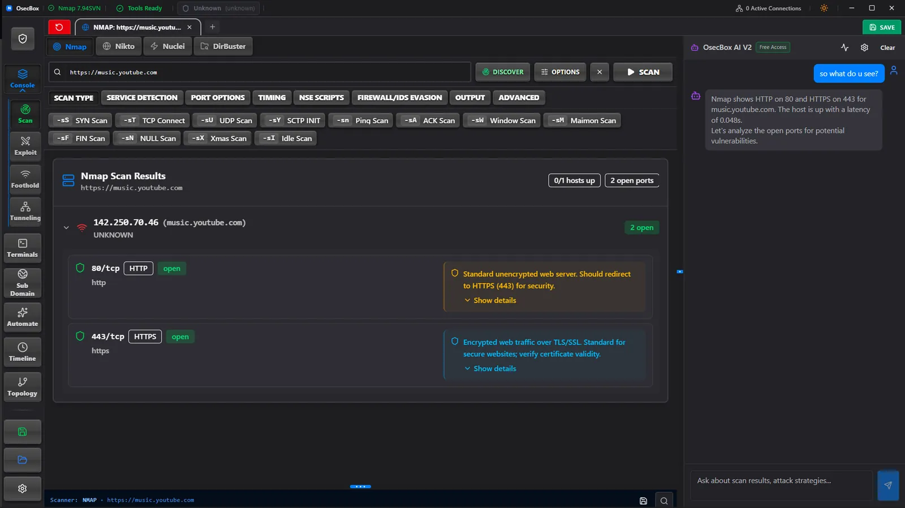
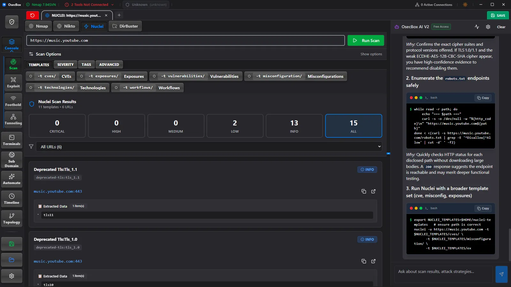
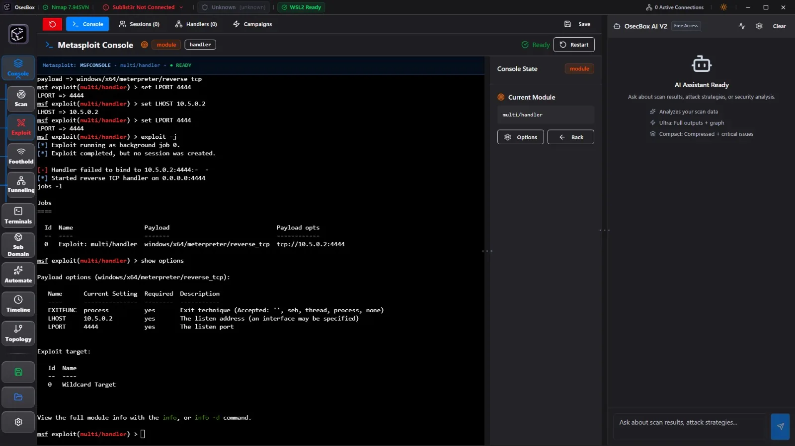
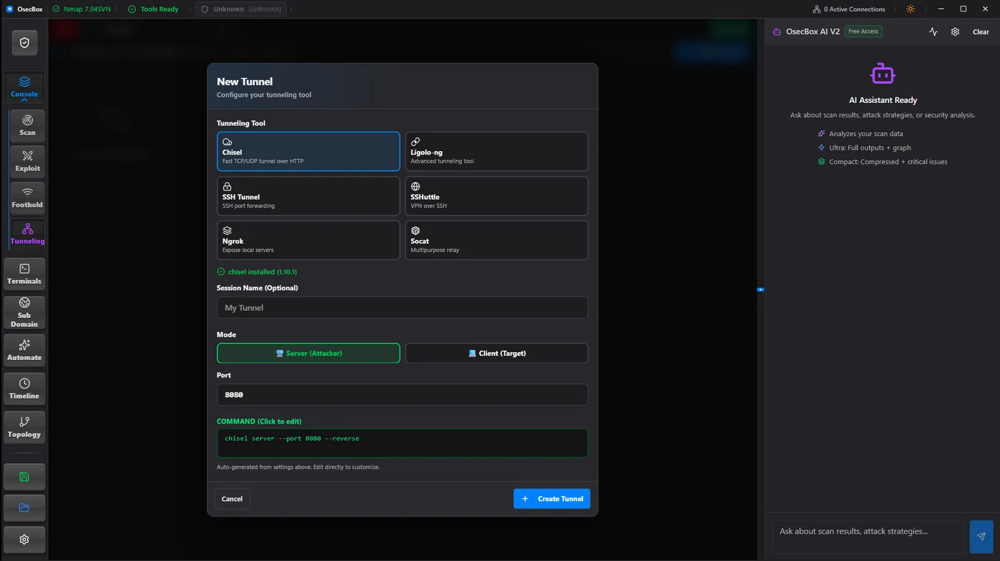
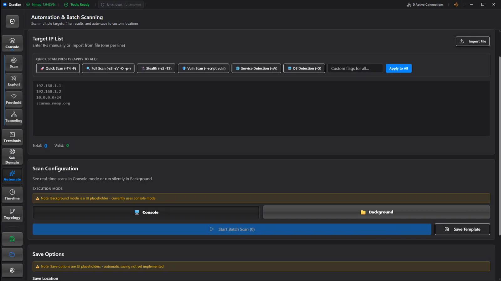

# OsecBox

> **An AI-assisted desktop workstation for authorized security testing that keeps recon, exploitation, terminals, listeners, pivots, and session context in one place.**

Security engagements often fragment across terminals, flags, output files, listeners, and handwritten notes. OsecBox brings the tools and context together in a desktop workspace, so you can move from discovery to analysis without repeatedly rebuilding the same command, losing a terminal, or disconnecting the evidence from the action that produced it.

**OsecBox is for systems and data you are explicitly authorized to test.**

## What is OsecBox?

OsecBox is an Electron desktop application for managing authorized penetration-testing workflows. It combines guided tool launchers with live terminal sessions and keeps scan output, findings, listeners, tunnels, AI context, and saved workspaces connected as an engagement progresses.

It is not a replacement for the underlying security tools. It is the workspace that makes their command, output, and session context easier to manage.

## What it does

### Discover and analyze

- Launch **Nmap**, **Nikto**, **Nuclei**, and directory-scanning workflows from one Console workspace.
- Review live terminal output beside parser-supported scan results, ports, findings, and hits.
- Run subdomain enumeration with supported tools including **Subfinder**, **Amass**, **Assetfinder**, **Sublist3r**, and **ffuf** when they are available in your configured runtime.
- Build a **network topology** from active scan results and current listeners, tunnels, and connections; export it as JSON or PNG.

### Keep the engagement together

- Open and work across **multiple terminal sessions** without leaving the app.
- Manage **Metasploit** console, handler, module, job, and session workflows.
- Configure listeners, reverse-shell workflows, **SSH tunnels**, **chisel**, proxy chains, and port forwarding with their associated terminal context.
- Use **Automate** for target lists and scan presets, and use the timeline/scheduler for supported scan workflows.

### Save the work, not just the output

- Use **Save** to preserve the current workspace session.
- Use **Load** to return to a saved workspace and continue the engagement where you left it.
- Keep the tools, terminals, findings, infrastructure state, and working context connected instead of reconstructing them across separate windows.

### Use AI your way

- Ask the **AI Assistant** to analyze captured scan and terminal context, explain findings, and suggest a next command for review.
- Configure the provider that fits your environment: **Groq**, **Cloudflare Workers AI**, **OpenRouter Free**, OpenAI, Anthropic, Google, Mistral, or a custom endpoint.
- Free-tier options are available through supported providers, subject to each provider’s account requirements, availability, and limits. OsecBox never replaces operator judgment: review every suggestion before acting on it.

## Core workflow

1. **Start with a target.** Use the Console scan workflow or Sub Domain view to begin discovery with the tools available in your configured runtime.
2. **Keep the evidence attached.** Each run has its own tab and terminal context, with parser-supported results kept beside the raw output.
3. **Understand the result.** Use the optional AI Assistant with your configured provider to analyze the captured context and suggest a next command for review.
4. **Continue the engagement.** Move into Metasploit, listener, and tunneling workflows while OsecBox retains the terminals and state that support them.
5. **Save, return, and extend.** Save the workspace, load it when work resumes, use batch or scheduled scan workflows where appropriate, and build a topology from active scan and infrastructure data.

## Key capabilities

### Recon with live output and parsed findings

Nmap configuration, live output, and parsed port/finding views belong to the same scan tab rather than separate tools and files.

### AI that starts with the work you just did

The AI Assistant can use the command and terminal/output context OsecBox has captured. Choose from supported provider presets—including free-tier options—or configure a custom endpoint. Review every suggested command and conclusion before acting on it.

### Metasploit, listeners, and session-aware infrastructure

OsecBox surfaces Metasploit console and handler workflows alongside listener and tunnel management, while preserving the associated terminal context.

| Metasploit workspace | Listener and tunnel management |
| --- | --- |
|  |  |

### Pivoting with visible configuration

Configure SSH tunnels, chisel, proxy chains, and port-forwarding workflows from the workspace, with the generated command visible for operator review before it runs.

## Why OsecBox

- **One engagement workspace.** Keep targets, commands, raw output, parsed results, terminals, listeners, tunnels, and saved sessions together instead of spread across windows.
- **Tool context, not a fake abstraction.** OsecBox works with real tool runtimes and displays their live output. It does not conceal what is being run.
- **A practical handoff between stages.** Scan data and active infrastructure can feed the topology view; Save and Load let you resume the workspace later.
- **AI choice, not lock-in.** Use supported free-tier provider options, another supported provider, or a custom endpoint that meets your needs.

## Product tour

### 1. Prepare a batch scan

Use **Automate** to enter or import a target list, apply a scan preset across the list, and run the batch in Console mode.

### 2. Map the engagement

The **Topology** view can generate a network map from active scan results and active listeners, tunnels, and connections. You can also draw a custom diagram and export it as JSON or PNG.

### 3. Save and resume the workspace

Use **Save** and **Load** to preserve the engagement workspace. OsecBox keeps its per-user application data in Electron’s normal user-data location, so you can return to the saved working context without administrator access.

## Architecture at a glance

OsecBox is an Electron-first desktop application:

- the **React renderer** provides the workspace and user interface;
- the **Electron main process** manages the desktop bridge, terminal/runtime integration, and IPC boundaries;
- the optional **Express server** supports the web renderer and AI API path.

For runtime boundaries and contributor ownership details, see [the architecture guide](docs/architecture.md).

## Installation

Download the current release from [GitHub Releases](https://github.com/DappianLabs/Osecbox/releases):

- **Windows x64:** use the NSIS installer for a normal installation, or the portable EXE for a no-install run.
- **Linux x64:** choose the AppImage, `.deb`, or `.tar.gz` package that suits your system.

Current tagged releases are published for Windows x64 and Linux x64. macOS packaging exists as future work but is not part of the current release lane.

OsecBox can run without every optional security tool installed. On Windows, workflows that use Linux-native tools require a working WSL2 version-2 distribution. Review the [optional setup guide](docs/setup.md) before installing tools or running setup helpers.

## Security

Use OsecBox only with explicit authorization. Review the target, command, credentials, and tool configuration before every security workflow.

For vulnerability reporting and release-verification guidance, see [SECURITY.md](SECURITY.md). Do not submit secrets, target data, or unredacted command transcripts in public issues.

## Releases

Releases are published on [GitHub Releases](https://github.com/DappianLabs/Osecbox/releases). Current releases cover Windows x64 and Linux x64. Maintainer-only signing, packaging, checksum, and release procedures are intentionally kept in [the release guide](docs/release.md), not in this product overview.

## Documentation

- [Architecture](docs/architecture.md) — high-level runtime boundaries
- [Development](docs/development.md) — contributor setup, verification, and packaging notes
- [Optional setup](docs/setup.md) — WSL2 and security-tool setup
- [Release guide](docs/release.md) — maintainer release process
- [Contributing](CONTRIBUTING.md) — contribution expectations
- [Security policy](SECURITY.md) — reporting and release-safety guidance

## License

[MIT](LICENSE) © OsecBox contributors.
